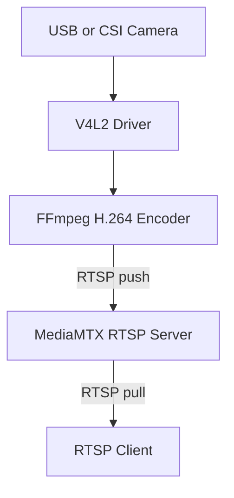

---

## Overview

PiStream-Lite is a minimal, reliable, and hardware-validated RTSP streaming setup for Raspberry Pi devices. It is specifically engineered for USB webcams and provides automatic recovery when the webcam is unplugged, reconnected, or when FFmpeg crashes. The setup also includes a complete rollback script to fully uninstall all components.

A One-Command RTSP Streaming Stack for Raspberry Pi 3B+, Pi 4, and Pi 5:
USB Webcam → H.264 RTSP Stream with Auto-Recovery and Rollback Support

This project exists to solve a frustrating problem shared by many Raspberry Pi users:
Getting a stable, low-latency H.264 RTSP stream from a USB webcam on Raspberry Pi boards without MotionEye, without MJPEG, and without unreliable community scripts.

---

### PiStream-Lite has been validated on

* Raspberry Pi 3B+ (64-bit only, baseline and stress-tested)
* Raspberry Pi 4
* Raspberry Pi 5

### Tested on

* Raspberry Pi OS Bookworm 64-bit (recommended)

### Successfully tested USB webcams

```
Bus 001 Device 010: ID 046d:0825 Logitech, Inc. Webcam C270
Bus 001 Device 011: ID 046d:082c Logitech, Inc. HD Webcam C615
```

Additional generic UVC-compliant webcams were also tested.

Designed and tested under real conditions:
cold plug, hot plug, delayed connection, boot with no camera, reconnect after minutes, RTSP viewer reconnects, docker conflict tests, v4l2 resets, ALSA failures, and systemd auto-restarts.

---

## Debian Package Installer (Headless Baseline)

PiStream-Lite was originally designed as a **headless-first** solution and is still available as a `.deb` package for users who prefer minimal setups.

```bash
wget https://github.com/855princekumar/PiStream-Lite/releases/download/v0.1.0/pistreamlite_0.1.0_arm64.deb
sudo dpkg -i pistreamlite_0.1.0_arm64.deb
```

### CLI commands

```
pistreamlite install
pistreamlite rollback
pistreamlite status
pistreamlite logs
pistreamlite doctor
pistreamlite version
```

### Why the `.deb` matters

* One-line install
* Auto-root handling
* Clean uninstall via `sudo apt remove pistreamlite.`
* No copying scripts manually
* Versioned deployments
* Future apt repository support

An apt repository will be released later for:

```
sudo apt install pistreamlite
```

Credential-secured RTSP streaming support will be included once RTSP authentication is fully stabilized.

---

# Why This Project Exists

Over several days, nearly every RTSP failure scenario commonly faced by Raspberry Pi users was encountered:

* OpenCV wheels missing for ARM64
* MediaMTX flag changes (`--config` deprecated)
* MJPEG-only tools (MotionEye, mjpg-streamer)
* FFmpeg ALSA crashes
* Missing or mismatched pixel formats (YUYV422)
* MediaMTX failing to bind RTSP port 8554
* systemd restart loops caused by wrapper scripts
* Hot-plug instability on Raspberry Pi 3B+
* Docker device and permission conflicts across Pi generations

Many online tutorials were incomplete, outdated, or incompatible with MediaMTX v1.15+.

Instead of stacking broken guides, PiStream-Lite was built as a **single-click, supervised, auto-healing RTSP solution**.

---

# Core Goals

1. Works on all recent Raspberry Pi boards
2. No need to manually install OpenCV
3. Pure FFmpeg → MediaMTX (H.264 RTSP)
4. Auto-recovers when the camera is unplugged
5. Auto-restarts FFmpeg and MediaMTX on failure
6. One-command install, one-command rollback
7. Under two minutes setup time
8. Zero manual configuration required

After multiple generations of scripts, PiStream-Lite emerged as the final stable approach.

---

# Features (Baseline)

* True RTSP (H.264) streaming
* Auto-recovery on USB camera disconnect/reconnect
* Unified systemd-managed service
* Clean uninstall (rollback)
* Compatible with Pi 3B+, Pi 4, Pi 5
* Plug-and-play streaming
* No OpenCV dependency
* MediaMTX 1.15+ support
* Professional-grade stability
* Supports USB webcams up to 1080p
* Stable RTSP endpoint
  `rtsp://<pi-ip>:8554/usb`

---

# Extended Work and Evolution (Additive)

Everything below extends the original headless design.
No existing functionality is removed.

---

# GUI Evolution and Architecture (v2.x → v3.x)

PiStream-Lite’s GUI evolved along **two parallel but complementary tracks**:

* **v2.x series:** single-stream stability and security validation
* **v3.x series:** multi-stream orchestration and scaling

These tracks intentionally coexist.
Security and stability improvements are validated on **single-stream pipelines first**, then propagated to **multi-stream deployments**.

---

## v2.x GUI Evolution — Single-Stream Series

**Purpose:**
Establish a stable GUI control plane and validate authentication, monitoring, and recovery logic on a single RTSP stream.

**Key characteristics:**

* One RTSP stream per Pi
* GUI-first control and health monitoring
* Session-based authentication at GUI level
* Resource-aware operation on Pi 3B+
* Serves as the security and correctness baseline


v2.x series GUI evolution – System Architecture & Flow

This image represents the architectural flow of the v2.x series, showing the relationship between the PiStream core, encoding pipeline, dashboard, monitoring, and secure access boundary.

---

## v3.x GUI Evolution — Multi-Stream Series

**Purpose:**
Scale the proven single-stream pipeline into a controlled multi-stream architecture while preserving isolation and stability.

**Key characteristics:**

* Multiple independent RTSP streams (usb1, usb2, usb3, usb4)
* Per-stream control and health isolation
* System-wide health visibility
* Designed for Pi 4 / Pi 5 with external power isolation
* Builds directly on lessons validated in v2.x


v3.x series GUI evolution – System Architecture & Flow

This image illustrates the multi-stream control plane, showing parallel stream supervision, consolidated health metrics, and scalable GUI orchestration.

---

## Authentication Model

Authentication is implemented at the **GUI level**, using a simple session-based model.

### Design characteristics

* Flask session cookies
* Local credential file (`/etc/usbstreamer/credentials.txt`)
* GUI access protection
* Password change from dashboard

This is intentionally **not high-complexity authentication**, to remain suitable for low-end embedded hardware.

### RTSP authentication status

* GUI authentication: stable
* RTSP-level authentication: under active testing

RTSP authentication currently introduces instability on low-end hardware due to handshake overhead interacting with FFmpeg and MediaMTX pipelines.
Once validated on single-stream setups, the same mechanism will be extended to multi-stream deployments.

---

## Multi-Camera Streaming (v3.x)

### Raspberry Pi 3B+ (Hard Limit)

* Single shared USB 2.0 bus
* USB and Ethernet multiplexed
* Limited power delivery
* CPU-only H.264 encoding

**Result**

* Maximum stable: 2 USB webcams
* 3–4 USB webcams are not feasible
* Bottlenecks occur at USB bandwidth and power delivery, not software

### Stable Pi 3B+ configurations

| Camera 1 | Camera 2 | Status   |
| -------- | -------- | -------- |
| 480p     | 480p     | Stable   |
| 720p     | 480p     | Stable   |
| 480p     | 720p     | Stable   |
| 720p     | 720p     | Unstable |

Dynamic resolution fallback is implemented to prevent pipeline crashes.

---

## Pi 4 / Pi 5: 3–4 Camera Support (v3 Test Scripts)

On Raspberry Pi 4 and Raspberry Pi 5, PiStream-Lite scales further **when power is isolated correctly**.

### Tested capability

| Platform | USB Cameras | Status                        |
| -------- | ----------- | ----------------------------- |
| Pi 4     | 3           | Stable                        |
| Pi 4     | 4           | Stable (with power isolation) |
| Pi 5     | 4           | Smooth and stable             |

This does not apply to Pi 3B+.

---

## Power Isolation and USB Power HAT

A dedicated USB power-isolation HAT was designed to:

* Separate USB power and data lines
* Power peripherals externally
* Eliminate voltage drops and brownouts
* Allow the Pi to focus purely on processing and I/O

PCB design, schematics, BOM, and validation notes will be published in a **separate dedicated hardware repository** to avoid bloating this repo.

---

## CSI Camera Support (In Progress)

CSI camera streaming using the same FFmpeg → MediaMTX pipeline is under active testing and will be released once validated.

---

# Architecture Overview

## High-Level Streaming Flow



---

# Folder Structure (Updated)

```
PiStream-lite/
├── v1.0/
├── v2.x/
├── v3.x/
└── README.md
```

Each folder includes install and rollback scripts, along with GUI preview assets where applicable.

---

# Roadmap

* Stable RTSP authentication
* CSI camera integration
* Publish power HAT hardware repository
* Pi 4 vs Pi 5 benchmarks
* Multi-camera GUI refinements

---

# License

MIT License
You may use, modify, and distribute freely.

---
